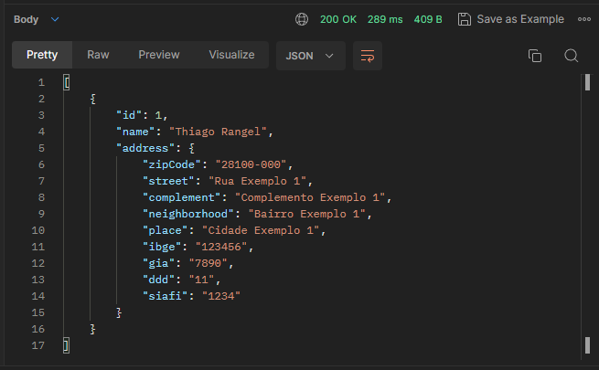
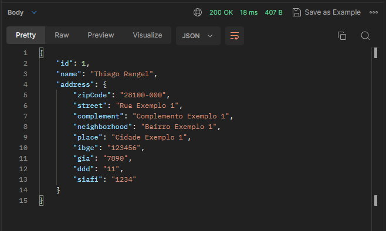
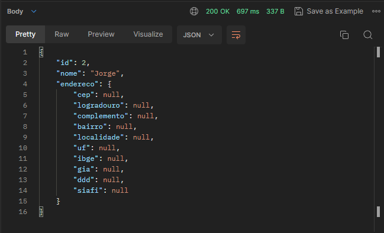

# API CEP

### Find all clients in database
- Endpoint `GET http://localhost:8080/clients`

- Output



### Find By Id in database
- Endpoint `GET http://localhost:8080/clients/1`

-Output


### Create a new register
- Endpoint `POST http://localhost:8080/clients`
- Input `body`
```bash
{
    "nome": "Jorge",
    "endereco": {
        "cep": "28200120"
    }
}
```

- Output
